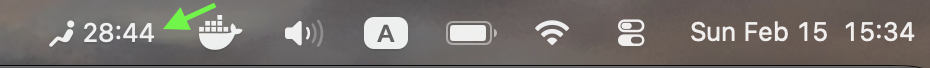

[](README.md) [](README.ja.md)

# TATSU


> 立て。血流を守れ。

TATSUは、定期的に立ち上がることをリマインドするミニマルなmacOSアプリです。

シンプルな問題から生まれました：
長時間の座りっぱなしは身体を壊す。

このアプリがやることはひとつだけ：

**静的な圧迫を断ち切る。**

---

## なぜ TATSU？

現代の生活は私たちを座らせ続けます。

- 長時間のコーディング
- リモートワーク
- 終わらない会議
- 集中作業

長時間の着座は血行を悪化させ、特に下半身への身体的ストレスを増加させます。

TATSUは、その惰性をそっと断ち切る存在です。

立つ。
血流を回復する。
姿勢をリセットする。
続ける。

---

## フィロソフィー

TATSUはシンプルな考えに基づいています：

**立つことはフィットネスではない。
リセットだ。**

ゲーミフィケーションなし。
カロリー計算なし。
ノイズなし。

ただ、立ち上がるための静かなリマインダー。

---

## 機能

- ⏱ スタンディング・散歩間隔をメニューから変更可能
- 🔔 macOS標準の通知に対応
- 🧘 ミニマルな禅スタイルのデザイン
- 🐉 昇り龍をモチーフにしたシンボリックなアイコン

---

## デザインコンセプト

アイコンが表すもの：

- 円 = 静止 / 圧迫
- 垂直線 = 立つ / 解放

黒背景 × 白い細線。

ミニマル。意図的。集中。

---

## スクリーンショット

### メニューバー



### 通知


---

## こんな人のために

- 開発者
- リモートワーカー
- 集中作業をする人
- 長時間座りがちなすべての人

---

## ステータス

初期プロトタイプの段階です。

現在はmacOSでローカル実行されます。
今後の改善予定：

- Apple Watch連携
- ヘルスデータ統合
- スマートな活動検出
- 高度なリマインダーロジック

---

## インストール

```bash
git clone https://github.com/hodanov/TATSU.git
cd TATSU
./build.sh
open build/TATSU.app
```

macOS 13.0以降とXcode Command Line Toolsが必要です。

---

## ライセンス

このプロジェクトは[MITライセンス](LICENSE)の下で公開されています。

---

## 作者

Built by @hodanov
